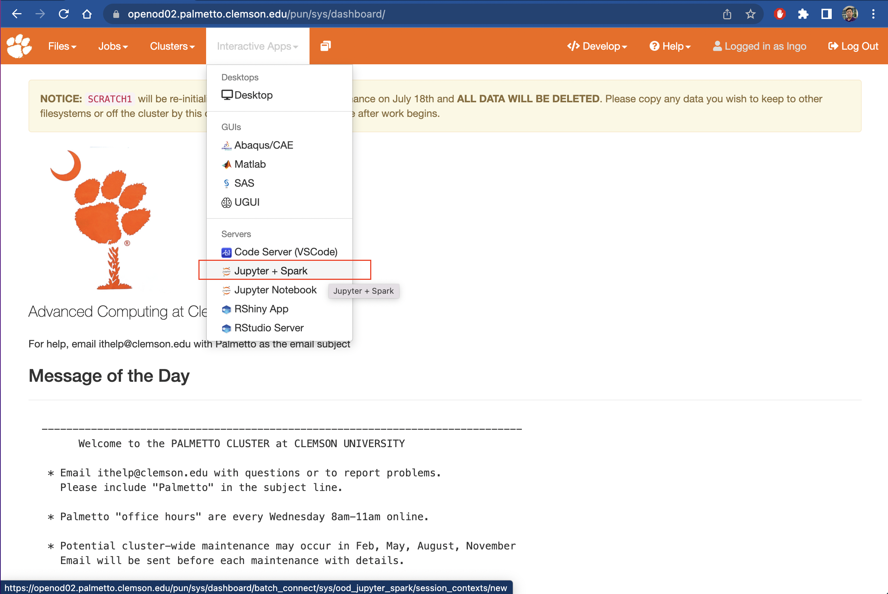
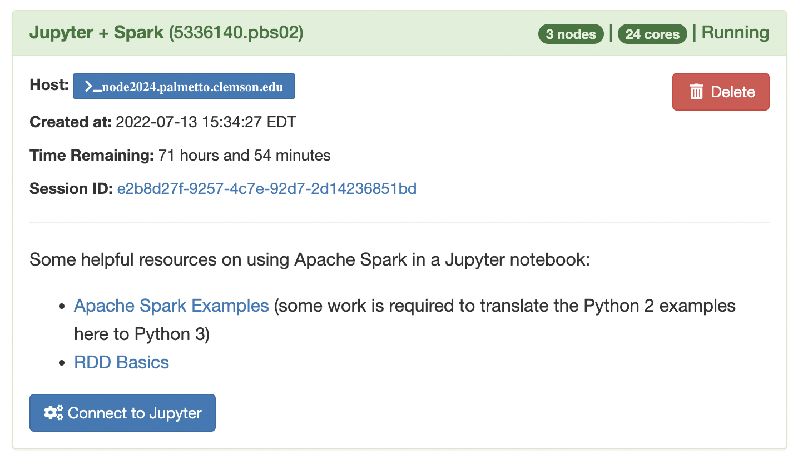
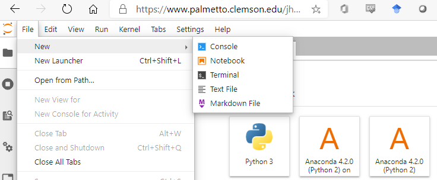
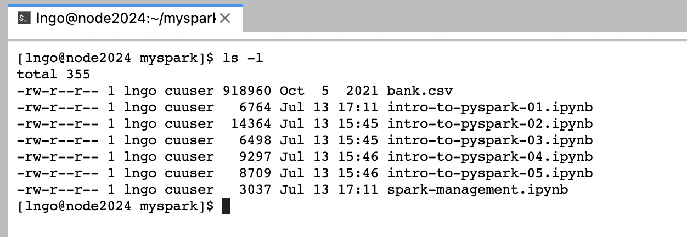

> ## Prerequisites
> You must have an active Palmetto account. To register
> for a Palmetto account, visit [New Account Request page](https://www.palmetto.clemson.edu/palmetto/basic/new/). 
>
{: .callout}

> ## Step 1. Open OnDemand
> 
> - Open a browser and go to [https://openod02.palmetto.clemson.edu/](https://openod02.palmetto.clemson.edu/).
> - Go to the `Jupyter+Spark` app
>
> 
>
{: .slide}

> ## Step 2. Jupyter + Spark app
> 
> - Select the options for the app as described below, then click `Launch`
>   - `Number of resource chunks (select)`: `3`
>   - `CPU cores per chunk (ncpus)`: `8`
>   - `Amount of memory per chunk (mem)`:  `15gb`
>   - `Number of GPUs per chunk (ngpus)`:  `None`
>   - `GPU Model (gpu_model)`: `None`
>   - `Interconnect`: `1g - Ethernet older phases 1-6`
>   - `Walltime`: `04:00:00`
>   - `Queue`: `work1`
>   - `Spark version`: `3.1.2`
>   - `Anaconda Version`: `anaconda3/2021.05-gcc/8.3.1`
>   - `Number of workers per node`: `1`
>   - `Only launch the driver on the master node.`: Check this box. 
> - Once the job is ready and the infrastructure is launched, click `Connect to Jupyter`. 
>
> 
>
{: .slide}

> ## Step 3. Getting Workshop Materials
> 
> - Select `File`/`New`/`Terminal`
>
> 
>
> - Run the following commands in the terminal
>
> ~~~
> $ cp -R /zfs/citi/spark/myspark .
> $ cd myspark
> $ ls -l
> ~~~
> {: .language-bash}
>
> 
{: .slide}


